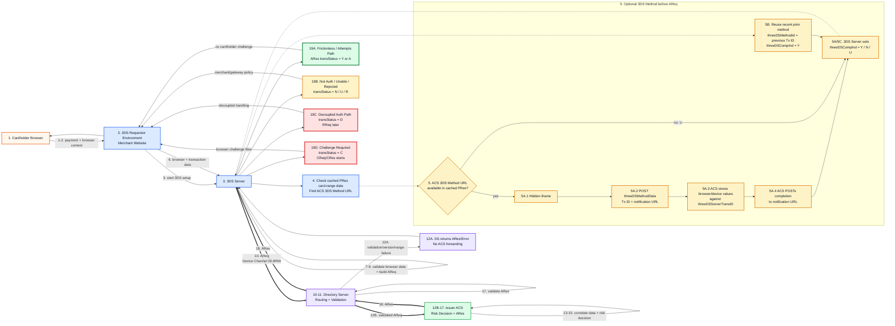
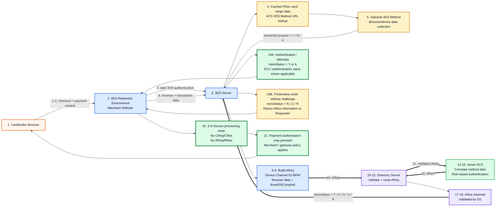
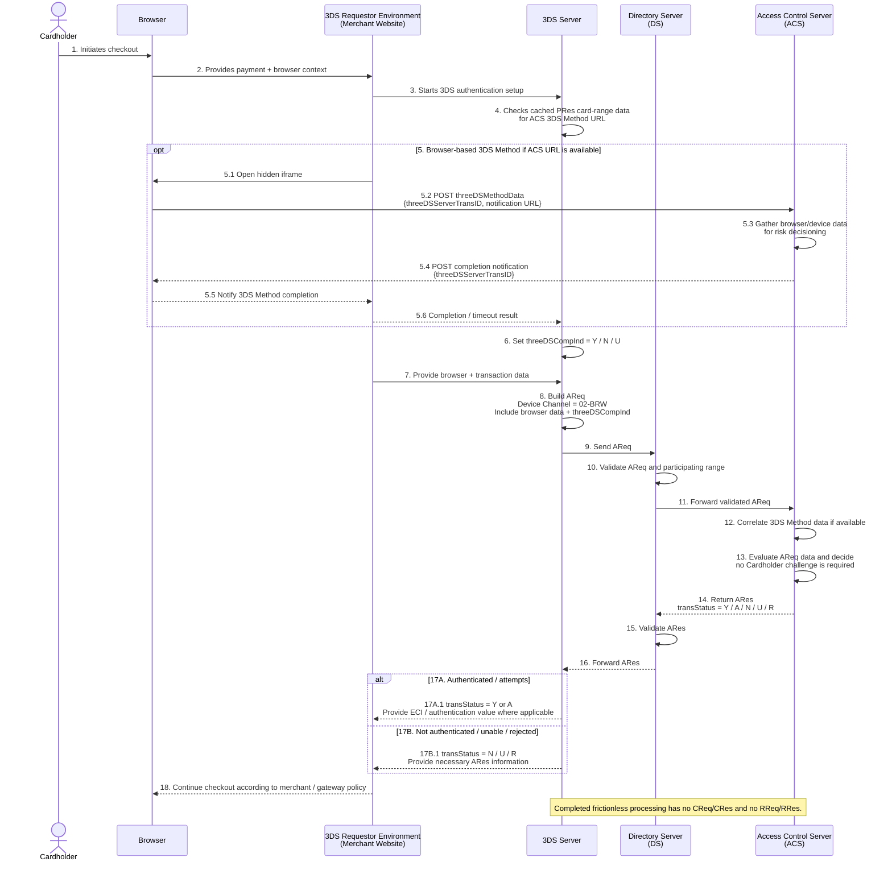
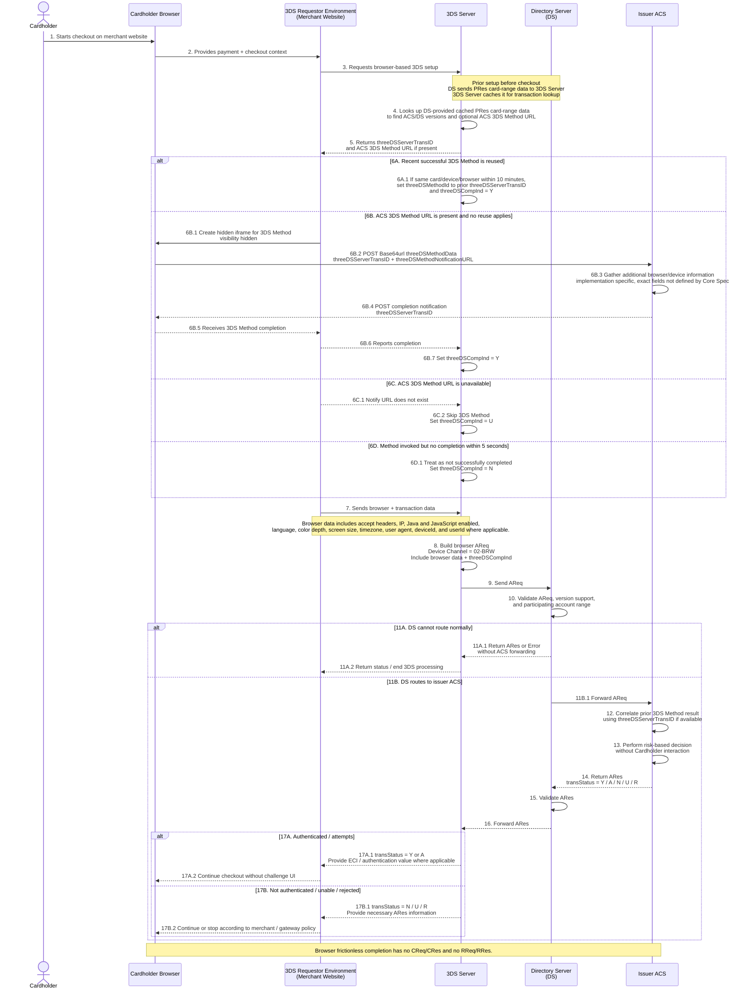

# Browser-Based EMV 3DS 2.x Frictionless Flow

Source basis: `prism-uploads/EMVCo_3DS_CoreSpec_v2.3.1_20220831.pdf`

This version follows the EMVCo 3-D Secure Protocol and Core Functions Specification v2.3.1.

## Spec-Accurate Notes

- The Frictionless Flow starts with `AReq` and `ARes`.
- If the ACS decides no further Cardholder interaction is required, authentication completes without a challenge.
- If the ACS decides Cardholder interaction is required, the flow transitions into Challenge Flow.
- Browser-based 3DS Method is optional and occurs before `AReq` when an ACS 3DS Method URL is available for the card range.
- The 3DS Requestor invokes the 3DS Method in the Cardholder Browser using a hidden iframe.
- The browser posts `threeDSMethodData` to the ACS 3DS Method URL.
- `threeDSMethodData` contains `threeDSServerTransID` and `threeDSMethodNotificationURL`.
- The ACS stores gathered values against the same `threeDSServerTransID` that later appears in `AReq`.
- The ACS posts completion notification back to the 3DS Method Notification URL through the browser iframe.
- The 3DS Server sets `threeDSCompInd = Y` if completion is notified; `N` if the method did not run or did not successfully complete; and `U` if the ACS 3DS Method URL was unavailable in PRes card-range data.
- If a successful prior 3DS Method for the same card, device, and browser is reused within 10 minutes, the 3DS Server sets `threeDSMethodId` to the previous 3DS Server Transaction ID and `threeDSCompInd = Y` in `AReq`.
- Browser data included in `AReq` can include accept headers, IP address, Java enabled, language, screen color depth, screen height/width, timezone, and user agent; the 3DS Server is responsible for ensuring browser data is not altered or hard-coded and is unique to each transaction.
- Before sending `AReq`, the 3DS Server must ensure the 3DS Method was executed within the previous 10 minutes when required; otherwise the 3DS Requestor re-executes it.
- The ACS must not initiate Cardholder interaction as part of a frictionless transaction; Cardholder interaction belongs to Challenge Flow.
- `RReq` / `RRes` are not present in a completed frictionless transaction.
- After receiving `ARes`, the 3DS Server treats `transStatus = Y` or `A` as the authenticated / attempts path for authorisation data handling.
- For `transStatus = N`, `U`, or `R`, the 3DS Server sends the necessary ARes information to the 3DS Requestor Environment and continues to Step 22.
- For `transStatus = D`, processing moves to Decoupled Authentication handling, where the ACS later sends `RReq`; this is not a completed frictionless transaction.
- For `transStatus = C`, the browser flow transitions to Challenge Flow and uses `CReq` / `CRes`.
- The DS can also return an `ARes` or `Error` to the 3DS Server without forwarding to the ACS if DS validation, version support, or participating-range checks fail.

## Numbered Sequence Diagram

```mermaid
sequenceDiagram
    actor CH as Cardholder
    participant BR as Browser
    participant RE as 3DS Requestor Environment<br/>(Merchant Website)
    participant S as 3DS Server
    participant DS as Directory Server<br/>(DS)
    participant ACS as Access Control Server<br/>(ACS)

    CH->>BR: 1. Initiates checkout
    BR->>RE: 2. Provides payment + checkout context
    RE->>S: 3. Starts 3DS authentication setup

    Note over RE,S: 4. 3DS Requestor / 3DS Server use cached PRes card-range data<br/>to determine whether an ACS 3DS Method URL exists.

    alt 5A. ACS 3DS Method URL exists and recent reusable method result is not used
        RE->>BR: 5A.1 Open hidden iframe<br/>style="visibility:hidden"
        BR->>ACS: 5A.2 HTTP POST threeDSMethodData<br/>{threeDSServerTransID, threeDSMethodNotificationURL}<br/>to ACS 3DS Method URL
        Note over ACS: 5A.3 ACS gathers browser/device information<br/>and stores values with threeDSServerTransID
        ACS-->>BR: 5A.4 HTTP POST threeDSMethodData<br/>{threeDSServerTransID}<br/>to 3DS Method Notification URL
        BR-->>RE: 5A.5 3DS Method notification received
        RE-->>S: 5A.6 Notify 3DS Method completed
        S->>S: 5A.7 Set threeDSCompInd = Y
    else 5B. Recent successful prior 3DS Method is reused
        Note over S: 5B.1 If reused within 10 minutes for same card/device/browser,<br/>set threeDSMethodId = previous threeDSServerTransID<br/>and threeDSCompInd = Y in AReq.
    else 5C. No ACS Method URL or timeout/non-completion
        Note over S: 5C.1 If ACS Method URL is unavailable,<br/>set threeDSCompInd = U.<br/>If method is invoked but no completion within 5 seconds,<br/>set threeDSCompInd = N.
    end

    RE->>S: 6. Provide browser + transaction data
    S->>S: 7. Ensure required browser data is available,<br/>not altered/hard-coded, and unique to transaction
    S->>S: 8. Ensure 3DS Method execution is within previous 10 minutes<br/>when required; otherwise re-execute via 3DS Requestor
    S->>S: 9. Build AReq<br/>Device Channel = 02-BRW<br/>Include browser data + threeDSCompInd
    S->>DS: 10. Send AReq
    DS->>DS: 11. Validate AReq, check version support,<br/>and check participating account range

    alt 12A. DS cannot continue normal routing
        DS-->>S: 12A.1 Return ARes or Error<br/>as defined by DS rules / error condition
        S-->>RE: 12A.2 Return status or end 3DS processing
    else 12B. DS routes request to ACS
        DS->>ACS: 12B.1 Forward AReq
        ACS->>ACS: 13. Correlate prior 3DS Method data<br/>using threeDSServerTransID if available
        ACS->>ACS: 14. Perform risk-based authentication decision
        Note over ACS: 15. ACS must not initiate Cardholder interaction<br/>inside a frictionless transaction.
        ACS-->>DS: 16. Return ARes
        DS->>DS: 17. Validate ARes content
        DS-->>S: 18. Forward ARes

        alt 19A. Frictionless / attempts path
            S-->>RE: 19A.1 transStatus = Y or A<br/>Provide ECI / authentication value where applicable
            RE-->>BR: 19A.2 Continue checkout without challenge UI
        else 19B. Not authenticated / unable / rejected
            S-->>RE: 19B.1 transStatus = N / U / R<br/>Send necessary ARes information
            RE-->>BR: 19B.2 Continue or stop according to merchant / gateway policy
        else 19C. Decoupled authentication path
            S-->>RE: 19C.1 transStatus = D<br/>Decoupled handling; ACS later sends RReq
        else 19D. Browser Challenge Flow path
            S-->>RE: 19D.1 transStatus = C<br/>Transition to Challenge Flow<br/>(CReq / CRes path, out of scope here)
        end
    end

    Note over S,ACS: 20. In completed frictionless / attempts path, no CReq/CRes occurs.
    Note over S,ACS: 21. RReq/RRes are not present in completed frictionless flow;<br/>RReq appears in challenge or decoupled paths, not in frictionless completion.
```

## Numbered Compact LinkedIn-Friendly Mermaid Version



## Frictionless-Only Mermaid Version



## Frictionless-Only Sequence Diagram



## Browser-Based Frictionless-Only Sequence Diagram

