# LinkedIn Cover: EMV 3DS Part 1

Use this Mermaid diagram as the source for the LinkedIn cover image.

```mermaid
flowchart LR
    title["Architectural Foundations\nof EMV 3DS 2.x"]
    subtitle["Part 1: Mapping the Three Domains Behind 3DS 2.x"]

    subgraph A["ACQUIRER DOMAIN"]
        direction TB
        browser["Shopper Browser\nUntrusted Client Edge"]
        merchant["Merchant Checkout\nCollects transaction context"]
        threeDS["3DS Server\nBuilds AReq"]
    end

    subgraph I["INTEROPERABILITY DOMAIN"]
        direction TB
        ds["Directory Server\nRoutes + validates messages"]
        schema["Protocol Validation\nVersion + schema checks"]
    end

    subgraph U["ISSUER DOMAIN"]
        direction TB
        acs["Access Control Server\nRisk engine + authentication authority"]
        decision{"Frictionless\nor Challenge?"}
    end

    title --- subtitle
    subtitle -. "map the trust boundaries first" .-> browser

    browser -->|device + browser signals| merchant
    merchant -->|checkout metadata| threeDS
    threeDS ==>|AReq| ds
    ds --> schema
    schema ==>|validated AReq| acs
    acs ==>|ARes| ds
    ds ==>|authentication result| threeDS
    threeDS --> decision

    classDef headline fill:#0f172a,stroke:#0f172a,color:#ffffff,font-weight:bold;
    classDef edge fill:#fef3c7,stroke:#d97706,stroke-width:2px,color:#111827;
    classDef acquirer fill:#dbeafe,stroke:#2563eb,stroke-width:2px,color:#111827;
    classDef interop fill:#ede9fe,stroke:#7c3aed,stroke-width:2px,color:#111827;
    classDef issuer fill:#dcfce7,stroke:#16a34a,stroke-width:2px,color:#111827;
    classDef decision fill:#fee2e2,stroke:#dc2626,stroke-width:3px,color:#111827;

    class title,subtitle headline;
    class browser edge;
    class merchant,threeDS acquirer;
    class ds,schema interop;
    class acs issuer;
    class decision decision;

    style A fill:#eff6ff,stroke:#2563eb,stroke-width:3px,color:#1e3a8a
    style I fill:#f5f3ff,stroke:#7c3aed,stroke-width:3px,color:#4c1d95
    style U fill:#f0fdf4,stroke:#16a34a,stroke-width:3px,color:#14532d
```

## Cover Text

**Architectural Foundations of EMV 3DS 2.x**

**Part 1: Mapping the Three Domains Behind 3DS 2.x**

Acquirer Domain → Interoperability Domain → Issuer Domain

## LinkedIn Caption Overlay

Before analyzing AReq/ARes, map the trust boundaries.